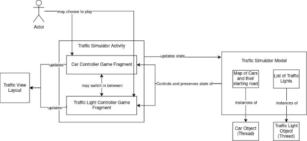
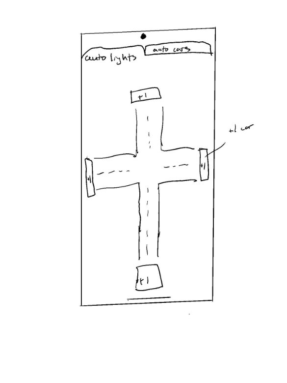

## SWEN 342 Concurrent and Distributed Systems: Traffic Light Simulator Android Game Design Document

## Overview

This document describes the general architecture of the Traffic Light Simulator Android Game which consists of two different ‘games’: a car controller game, and a traffic light controller game. The former is a view of a simple four-way intersection in which you control how many cars spawn in from the roads on the poles of the screen. While the cars are controlled by the player, the four traffic lights situated at the middle of the intersection, respective of each road, are controlled automatically by a backend traffic controller. Alternatively, the traffic light controller game is in essence the exact opposite of this; the player controls the traffic lights and cars are randomly spawned in from each of the four roads.

## Summary of Architecture

For the most part, the design of the system follows a Model-View-Controller (MVC) architecture pattern. The model is comprised of the Traffic Sim Model which handles states of the game. This model controls the view and controller which are represented by the two different fragments, the car controller fragment and the traffic light controller fragment, as well as the main traffic sim activity which holds the fragments. These all are visually displayed through a layout and controlled via the view and controller.

Players will have the option of switching between the two modes regardless of the time or state of the game. Game state consists of the amount, types, and position of cars located around the intersection as well as the different states of the traffic lights (red, yellow, green). It is preserved and controlled by a Traffic Sim Model which has instances of traffic lights and cars, which are both Java threads. As players play the game, they will be able to change the amount of cars in the intersection, or change the lights allowing or blocking traffic on the roads. When switching between the two game modes, the model will update the player’s actions of whether they can spawn cars or change lights.

Android projects are composed of activities and fragments, both representing concurrent processes within Android architecture. Activities represent individual screens of an application. Each activity has its own lifecycle, in short consisting of stages between starting, running, and stopping. Fragments are essentially instances of activities which help support reusable UI design. They, similar to activities, have their own lifecycles describing the state of the fragment, and are managed by a Fragment Manager - which is most likely the activity the fragment was created from.

Since there is only one layout view that needs to be displayed (the traffic intersection), two fragments are used to recycle the same layout while still maintaining a constant state from the Traffic Sim Model. Each fragment can be created or destroyed by the player’s command and will be used to control the layout while also updating the state for the model.

A simple block diagram is shown below to illustrate MVC architecture:

A crude drawing of the the approximate layout display of the game that the player will see and interact with:

